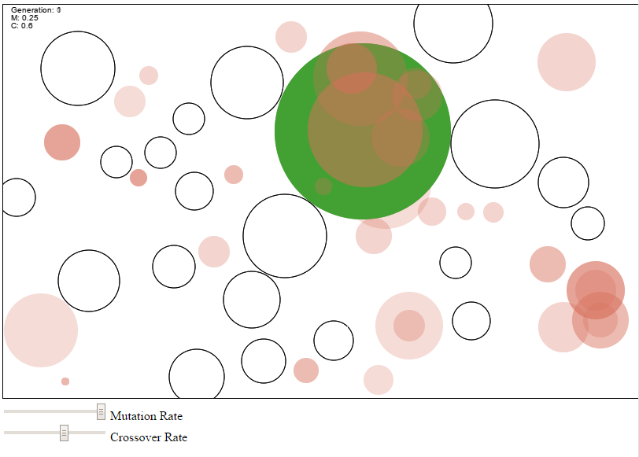

# GenFit+
*Original idea by [/peterfsat](https://github.com/peterfsat)*

Modified the original implementation in order to make it faster by changing
the mutation and crossover functions

By pressing space the genetic algorithm converges the red balls to the biggest ball it can fit among the circles (Green is the best fit found by brute force)

